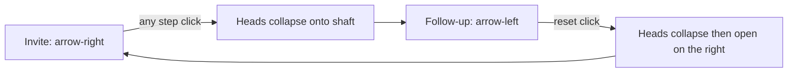

# Morph connect prompt icon: right arrow to left arrow

The click-driven icon today is [`MorphingConnectIcon`](src/components/MorphingConnectIcon/MorphingConnectIcon.tsx) on the reset button in [`ConnectPrompt.tsx`](src/components/ConnectPrompt/ConnectPrompt.tsx) (`variant={isInvite ? "workflow" : "send-to-back"}`). [`ConnectExcitement`](src/components/ConnectExcitement/ConnectExcitement.tsx) is a separate hover burst above “Wanna connect?” — it stays as-is.

**Recommendation:** add a new component (same pattern as [`MorphingArrowUpRight`](src/components/MorphingArrowUpRight/MorphingArrowUpRight.tsx)), not a variant on `ConnectExcitement`. That overlay uses a 90×60 viewBox, absolute positioning, and excitement tokens; mixing a 24×24 Lucide arrow into it would couple unrelated visuals.

Leave [`MorphingConnectIcon`](src/components/MorphingConnectIcon/MorphingConnectIcon.tsx) in the repo (unused from ConnectPrompt). Do not delete `ConnectExcitement`.



## Animation

Lucide 24×24, `strokeWidth={2}`, round caps — same as the current morphing icon.

- **Shaft:** static `M5 12 L19 12`
- **Right heads:** two lines from the right tip (`M19 12 L12 5`, `M19 12 L12 19`)
- **Left heads:** two lines from the left tip (`M5 12 L12 5`, `M5 12 L12 19`)

Drive visibility with `pathLength` (not a sliding `d` morph, which would drag the collapsed head along the shaft):

- Invite (`right`): right heads `pathLength: 1`, left heads `0`
- After any proceed click (`left`): right heads `1 → 0` (collapse into the shaft at the right tip), then left heads `0 → 1` (open from the left tip)
- Reset back to invite: reverse (left collapse, then right open)

Timing: match existing morph duration (`0.2s`, `easeInOut`). Second phase delayed by `0.2s`. Honor `useReducedMotion` by snapping both phases to duration `0`.

## Wiring

1. Add [`src/components/MorphingArrowRight/MorphingArrowRight.tsx`](src/components/MorphingArrowRight/MorphingArrowRight.tsx) + CSS.
   - Props: `variant: "right" | "left"` (same shape as MorphingConnectIcon).
   - CSS: `width`/`height: var(--icon-size)`, `color: currentColor` — inherit the reset button’s [`--color-text-label`](src/components/ConnectPrompt/ConnectPrompt.css).
2. In [`ConnectPrompt.tsx`](src/components/ConnectPrompt/ConnectPrompt.tsx), swap:

```tsx
<MorphingArrowRight variant={isInvite ? "right" : "left"} />
```

3. Point [`.connect-prompt-reset .morphing-connect-icon`](src/components/ConnectPrompt/ConnectPrompt.css) at the new class (same 100% size). Hover, disabled, and `:active` scale stay unchanged.

No token changes unless a new duration/easing is needed; reuse existing `--icon-size` and `--color-text-label`.
