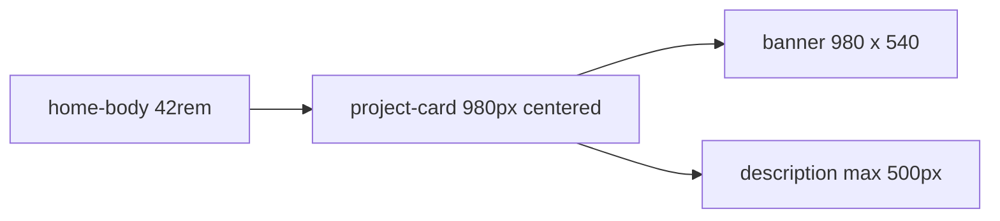

# Project card banner 980×540 + description max-width

## Current vs target

Card banners today are `width: 100%` of the home column ([`--content-width`](src/styles/tokens/semantics.css) = 42rem / ~672px) and [`--card-banner-height`](src/styles/tokens/semantics.css) = 26rem / 416px, set on [`.project-banner--card`](src/components/ProjectBanner/ProjectBanner.css). Descriptions span the full card width.

Target desktop size: **980×540** banner, description **max-width 500px**. Because 980px is wider than the 42rem column, the **card itself** will grow to the banner width on desktop and center on the column (negative inline margins), so the video stays inside the card frame instead of bursting the border.

Compact/mobile: width stays `100%` of the column; height follows the 980:540 aspect ratio (replacing the current 18rem / 14rem height overrides in [responsive.css](src/styles/tokens/responsive.css)).

## Tokens (no raw px in component CSS)

Per the token system, add rem primitives and semantic aliases.

**[primitives.css](src/styles/tokens/primitives.css)**
- `--size-card-banner-width: 61.25rem` (980px)
- Update `--size-card-banner-height: 33.75rem` (540px, was 26rem)
- `--layout-card-description-width: 31.25rem` (500px)

**[semantics.css](src/styles/tokens/semantics.css)**
- `--card-banner-width: var(--size-card-banner-width)`
- `--card-banner-height` already maps to the height primitive
- `--max-width-card-description: var(--layout-card-description-width)`

**[responsive.css](src/styles/tokens/responsive.css)**
- Remove `--card-banner-height` overrides at tablet/mobile. Height will scale from aspect-ratio instead of jumping to 18rem / 14rem. Page hero `--banner-height` overrides stay as they are.

## Component CSS

**[ProjectBanner.css](src/components/ProjectBanner/ProjectBanner.css)** — `.project-banner--card`:
- `width: min(var(--card-banner-width), 100%)`
- `height: auto`
- `aspect-ratio: var(--card-banner-width) / var(--card-banner-height)`
- Keep existing `object-fit: cover` on card media

**[ProjectCard.css](src/components/ProjectCard/ProjectCard.css)**
- Description: `max-width: var(--max-width-card-description)` on `.project-card-description`
- Desktop (`min-width: 68.75rem`, same breakpoint as banner bleed):
  - `.project-card` width = `var(--card-banner-width)` (capped with `min(..., calc(100vw - 2 * var(--inset-x)))`)
  - Center on the column: `margin-inline: calc((100% - <capped width>) / 2)`
- Compact: card remains `width: 100%`; banner `min(..., 100%)` keeps it inside the column

Parents already allow this: [`.content-section:has(.content-section-cards)`](src/components/ContentSection/ContentSection.css) is `overflow-x: visible`, and the home page uses `overflow-x: clip` on the viewport so extra width cannot cause page scroll.

No TSX changes. Page hero banners (`variant="page"`) are unchanged.

## Verify

- Home work **card** view: each banner is 980×540 on a ~1440px desktop; description wraps at 500px.
- Card frame still wraps the video (no video sticking out of the border).
- Compact (~800px) and mobile (~375px): banner is full column width, 980:540 ratio, no horizontal scroll.
- List view and project-page heroes unchanged.
