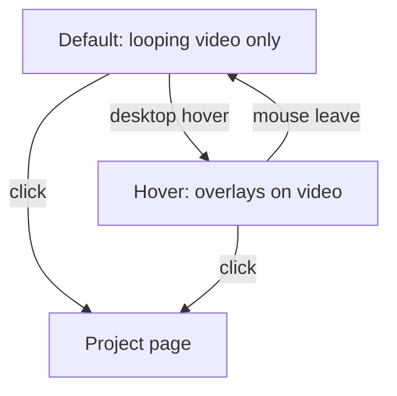

# Progressive-reveal project cards (disposable)

Prototype a video-first card that hides metadata until hover, mounted **below** the current Work / Personal cards. Existing [`ProjectCard`](src/components/ProjectCard/ProjectCard.tsx) is not modified.

## Interaction (from Figma)



- **Default** ([Figma 470:252](https://www.figma.com/design/7SObhe2tsBTV67x9WcOPsp/Portfolio?node-id=470-252)): full-bleed looping video (or image). No title, type, timeline, or description. No native video controls (the playback bar in Figma is canvas chrome).
- **Hover** ([Figma 470:237](https://www.figma.com/design/7SObhe2tsBTV67x9WcOPsp/Portfolio?node-id=470-237)), **desktop only** (`@media (hover: hover) and (pointer: fine)`):
  - Top overlay: title left, project type right, white text, fade-to-black gradient, light backdrop blur.
  - Bottom overlay: lime timeline (`--color-accent`), white description (cap width ~37.5rem), stronger gradient + blur.
  - Video keeps playing underneath.
- **Touch / coarse pointer**: overlays stay hidden. The card remains a link so tap still navigates.
- **Accessibility**: even with hidden overlays, the link gets an accessible name (`aria-label` from title + type) so screen readers are not dependent on hover.

Copy and media come from existing [`ProjectCardData`](src/data/projects/types.ts) via `getProjectCard` — not the Figma placeholder copy.

## Isolation

New folder: [`src/experiments/project-card-reveal/`](src/experiments/project-card-reveal/)

- `ProjectCardReveal.tsx` + `ProjectCardReveal.css` — the prototype card
- `ProjectCardRevealSection.tsx` + `ProjectCardRevealSection.css` — labeled section + list of cards
- `index.ts` — barrel export

Reuse, do not fork:

- [`LazyBannerVideo`](src/components/ProjectBanner/LazyBannerVideo.tsx) for lazy autoplay
- [`getProjectCard`](src/data/projectCards.ts) + Work + Personal items from [`workSections`](src/data/home.ts)
- Existing semantic tokens (`--color-white`, `--color-accent`, `--text-body-*`, `--gap-*`, `--card-banner-height`, `--blur-layer-*`)

Do **not** change [`ProjectCard`](src/components/ProjectCard/ProjectCard.tsx), [`ContentSection`](src/components/ContentSection/ContentSection.tsx), card data files, or global token files. Experiment-only values (overlay gradient, hover fade) live as local custom properties in the experiment CSS.

## Mount point (minimal production touch)

In [`HomePage.tsx`](src/components/HomePage/HomePage.tsx), after the existing `sections.map(...)`, render the experiment section when `activeTab === "work"` and `workViewMode === "card"`:

- Same `home-content` column, after Work / Personal / Notes
- Divider + section label (e.g. "Card experiment") so it is obviously disposable
- Same card stacking/gap as [`content-section-cards`](src/components/ContentSection/ContentSection.css)
- Hidden in list view and on the About tab
- Not added to [`HomeSidebar`](src/components/HomeSidebar/HomeSidebar.tsx)

Height uses `--card-banner-height` so the prototype sits in the same width/height system as current banners (content column is `42rem`; Figma frame is 978×580).

## Card structure

The prototype is a single media frame (not header + banner + footer):

```text
Link.project-card-reveal
  media (video/image, cover)
  header overlay (title | type)     opacity 0 → 1 on desktop hover
  footer overlay (timeline, desc)   opacity 0 → 1 on desktop hover
```

Honor `prefers-reduced-motion` (no fade, or instant). Keep hover styles in CSS, not JS. Plain CSS file, semantic class names, no Tailwind / inline styles — per project styling rules. Responsive by default: full-width media, wrapping type/description, no overflow.

## Verification

In the browser (card view, Work tab):

- Existing cards above are unchanged
- Experiment cards below start as video-only
- Desktop hover reveals overlays; mouse leave hides them
- Click still opens the project
- List view and About tab do not show the experiment
- Spot-check tablet/mobile: overlays stay hidden, tap still navigates
