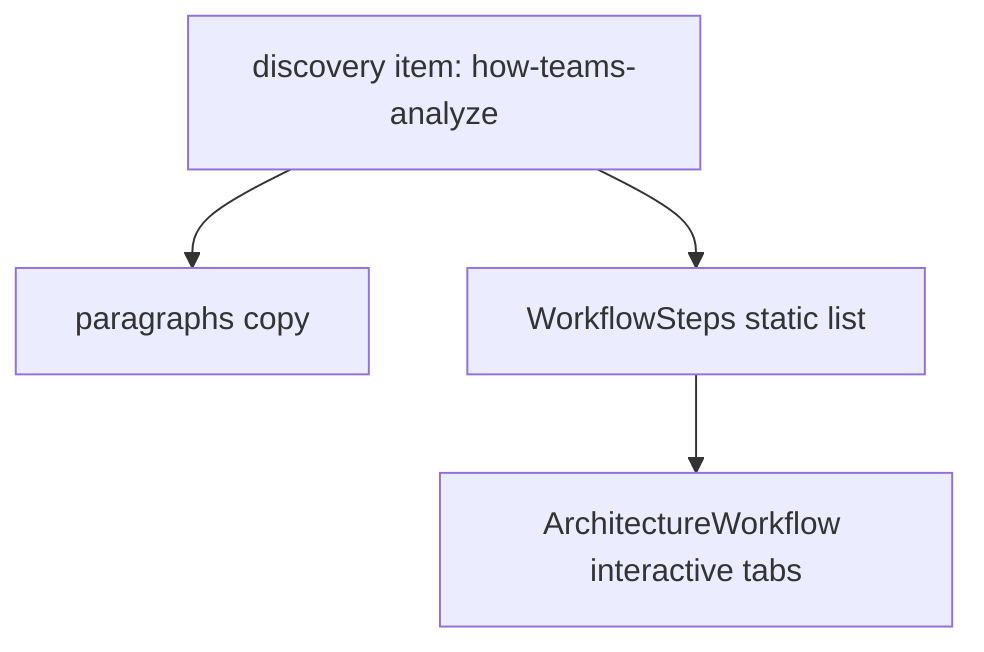

# Architecture Workflow in Conversation Insights

## Context

Conversation Insights already renders a static [`WorkflowSteps`](src/components/WorkflowSteps/WorkflowSteps.tsx) list inside the **"How did teams analyze issues?"** discovery expandable item ([`conversation-insights.ts`](src/data/projects/conversation-insights.ts) lines 129–156).

[`ArchitectureWorkflow`](src/components/ArchitectureWorkflow/ArchitectureWorkflow.tsx) is the interactive tabbed variant used today only on Architecture Agent via `project.product.workflow` ([`ProjectPage.tsx`](src/components/ProjectPage/ProjectPage.tsx) lines 167–170).



## Data mapping

`WorkflowStep` and `ArchitectureWorkflowStep` differ slightly:

| WorkflowStep | ArchitectureWorkflowStep |
|---|---|
| `title` | `label` |
| `description` | `heading` |
| `icon` | `icon` |
| — | `id` (derived from title) |

Add a small helper (e.g. [`src/data/projects/workflowMapping.ts`](src/data/projects/workflowMapping.ts)):

```ts
export function toArchitectureWorkflowSteps(
  steps: WorkflowStep[],
): ArchitectureWorkflowStep[] {
  return steps.map((step) => ({
    id: step.title.toLowerCase().replace(/[^a-z0-9]+/g, "-").replace(/(^-|-$)/g, ""),
    label: step.title,
    icon: step.icon,
    heading: step.description,
  }));
}
```

No duplicate step content in the data file — the architecture flow reads from the existing `workflow-steps` array.

## Type + data changes

**[`src/data/projects/types.ts`](src/data/projects/types.ts)**

Extend the `workflow-steps` visual variant:

```ts
| {
    type: "workflow-steps";
    steps: WorkflowStep[];
    showArchitectureWorkflow?: boolean;
  }
```

**[`src/data/projects/conversation-insights.ts`](src/data/projects/conversation-insights.ts)**

On the `how-teams-analyze` item visual, add:

```ts
showArchitectureWorkflow: true,
```

## Render changes

**[`src/components/ProjectPage/ProjectPage.tsx`](src/components/ProjectPage/ProjectPage.tsx)**

Update `ExpandableItemVisual` to render both components when flagged:

```tsx
function ExpandableItemVisual({ visual }: { visual: ExpandableVisual }) {
  if (visual.type === "source-cards") {
    return <SourceCards cards={visual.cards} />;
  }

  return (
    <div className="expandable-item-workflow">
      <WorkflowSteps steps={visual.steps} />
      {visual.showArchitectureWorkflow ? (
        <ArchitectureWorkflow
          steps={toArchitectureWorkflowSteps(visual.steps)}
          ariaLabel="Investigation workflow"
        />
      ) : null}
    </div>
  );
}
```

**[`src/components/ArchitectureWorkflow/ArchitectureWorkflow.tsx`](src/components/ArchitectureWorkflow/ArchitectureWorkflow.tsx)**

Add optional `ariaLabel` prop (default: `"Architecture Agent workflow"`) and pass it to the tablist `aria-label` so the component is reusable outside Architecture Agent.

## Styling

**[`src/components/ProjectPage/ProjectPage.css`](src/components/ProjectPage/ProjectPage.css)** (or co-located wrapper CSS)

Add spacing between the static list and interactive flow:

```css
.expandable-item-workflow {
  display: flex;
  flex-direction: column;
  gap: var(--gap-list-item);
  width: 100%;
  min-width: 0;
}
```

Uses existing `--gap-list-item` token (20px) — no new primitives.

## Files touched

| File | Change |
|------|--------|
| [`src/data/projects/types.ts`](src/data/projects/types.ts) | Add `showArchitectureWorkflow?` to workflow-steps visual |
| [`src/data/projects/workflowMapping.ts`](src/data/projects/workflowMapping.ts) | New `toArchitectureWorkflowSteps` helper |
| [`src/data/projects/conversation-insights.ts`](src/data/projects/conversation-insights.ts) | Enable flag on discovery workflow item |
| [`src/components/ProjectPage/ProjectPage.tsx`](src/components/ProjectPage/ProjectPage.tsx) | Render `ArchitectureWorkflow` below `WorkflowSteps` |
| [`src/components/ProjectPage/ProjectPage.css`](src/components/ProjectPage/ProjectPage.css) | Wrapper gap between the two components |
| [`src/components/ArchitectureWorkflow/ArchitectureWorkflow.tsx`](src/components/ArchitectureWorkflow/ArchitectureWorkflow.tsx) | Configurable `ariaLabel` |

## Out of scope

- Removing the existing `WorkflowSteps` list (both render per your request)
- Adding `product.workflow` to Conversation Insights (stays on the discovery expandable item)
- New Figma-specific copy or tool chips for Conversation Insights steps
