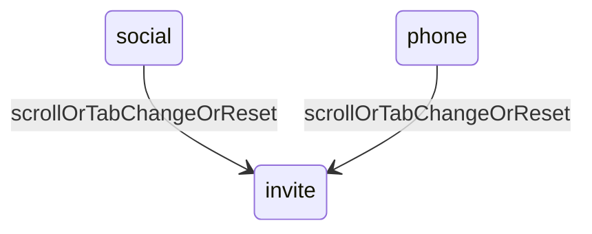

# Connect prompt dismiss on scroll / navigate

## Behavior

When `step` is **`social`** or **`phone`**:

1. **Scroll** — any window scroll resets to `invite`.
2. **Navigate** — switching Work/About (`activeTab` change) resets to `invite`.
3. Existing send-to-back reset and step entry/exit animations stay unchanged.
4. **No** countdown UI, timer, or opacity dimming.

Intermediate steps (`prefer`, `inPerson`) are unchanged — only manual reset or continuing the flow.

## Implementation

### [`ConnectPrompt.tsx`](src/components/ConnectPrompt/ConnectPrompt.tsx)

- Accept optional/required prop `activeTab: HomeTab` from HomePage (used only as a dismiss signal).
- `isFinalStep = step === "social" || step === "phone"`.
- `useEffect` when `isFinalStep`:
  - Add `window` `scroll` listener (`passive: true`) → call `reset()`.
  - Cleanup on leave / unmount.
- Separate `useEffect` (or same effect deps): when `activeTab` changes **and** currently on a final step → `reset()`. Use a ref for previous tab so the effect does not reset on first mount into a final step.
- Keep `AnimatePresence` + `tabContentBlurVariants` as-is.

### [`HomePage.tsx`](src/components/HomePage/HomePage.tsx)

- Pass `activeTab={activeTab}` into `<ConnectPrompt />`.

### CSS

- No changes required (no countdown styles).

## Out of scope

- Reset on arbitrary outside clicks
- Reset on view-mode (card/list) toggle
- Timer / dimming / countdown digit
- Changing intermediate-step behavior
