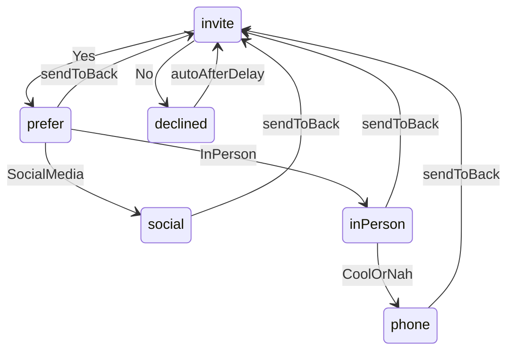

# Connect Prompt "No" Option

## Current behavior

[`ConnectPrompt.tsx`](src/components/ConnectPrompt/ConnectPrompt.tsx) is a step-based state machine with `AnimatePresence` + `tabContentBlurVariants` (0.2s blur fade) on each step change. The invite step currently only offers "Yes".

```87:105:src/components/ConnectPrompt/ConnectPrompt.tsx
    case "invite":
      content = (
        <>
          <PromptText>Wanna Connect?</PromptText>
          <Options
            items={[
              {
                key: "yes",
                node: (
                  <PromptAction onClick={() => setStep("prefer")}>
                    Yes
                  </PromptAction>
                ),
              },
            ]}
          />
        </>
      );
      break;
```

## Proposed flow



## Implementation (single file change)

All changes in [`ConnectPrompt.tsx`](src/components/ConnectPrompt/ConnectPrompt.tsx). No CSS changes needed — the acknowledgment reuses `PromptText`.

### 1. Extend step type

```ts
type ConnectStep = "invite" | "declined" | "prefer" | "social" | "inPerson" | "phone";
```

### 2. Add "No" to invite options

Add a second option alongside "Yes", separated by the existing `/` via `Options`:

- **Yes** → `setStep("prefer")` (unchanged)
- **No** → `setStep("declined")`

### 3. Add `declined` step content

Text-only step (no actions):

```tsx
case "declined":
  content = (
    <PromptText>No worries. I like the honesty :)</PromptText>
  );
  break;
```

### 4. Auto-reset with `useEffect`

When `step === "declined"`, schedule a return to `"invite"` after a short display window. Pattern matches timed behavior in [`HomeFooter.tsx`](src/components/HomeFooter/HomeFooter.tsx).

Suggested timing (aligned with [`tabContent.ts`](src/motion/tabContent.ts) `duration: 0.2`):

- `DECLINED_DISPLAY_MS = 2200` — enough time to read the message after the enter animation
- On timeout: `setStep("invite")` — `AnimatePresence` runs exit blur on `declined`, then enter blur on `invite`

```tsx
useEffect(() => {
  if (step !== "declined") return;
  const timer = window.setTimeout(() => setStep("invite"), DECLINED_DISPLAY_MS);
  return () => window.clearTimeout(timer);
}, [step]);
```

Add `useEffect` import from React.

### 5. Icon / reset button behavior

Keep existing logic: `isInvite = step === "invite"`. During `declined`, the reset button becomes active (send-to-back icon) so the user can skip the wait — optional but consistent with other non-invite steps. No change required unless you prefer disabling reset during auto-dismiss.

## Test plan

1. Load home page — confirm initial state shows `Wanna Connect?` / `Yes` / `No`.
2. Click **No** — blur transition to `No worries. I like the honesty :)`.
3. Wait ~2.2s — blur transition back to initial invite state with no options stuck visible.
4. Click **Yes** — confirm existing prefer → social/in-person flow still works.
5. Click send-to-back on any later step — confirm reset to invite still works.
6. (Optional) On declined step, click send-to-back before timeout — confirm immediate return to invite and timer cleanup on unmount.
