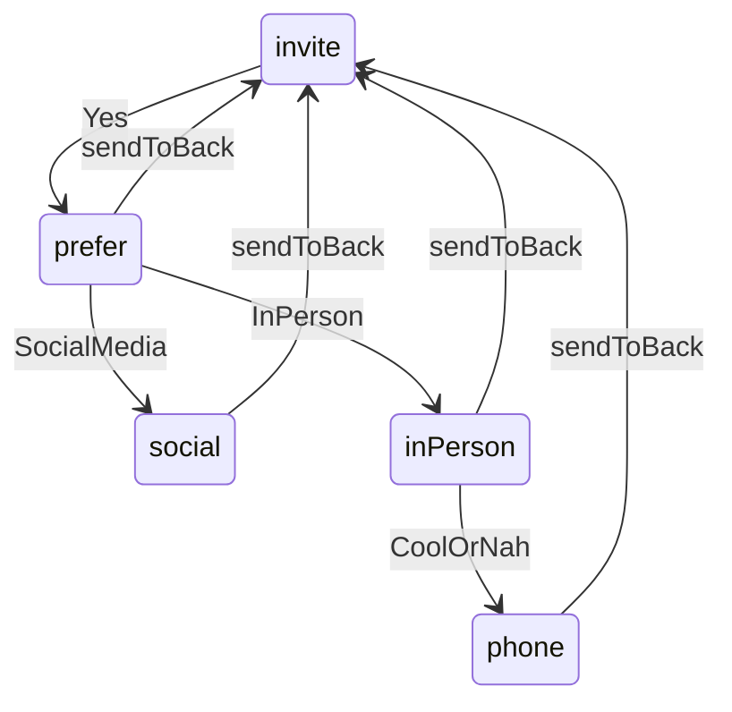

# Home connect prompt flow

## Behavior (single replaced line)

State machine in one footer line (wraps naturally if needed):

1. **invite** — `Wanna Connect?` (muted) + `Yes` (action)
2. After Yes → **prefer** — `[send-to-back]` + `How do you prefer?` + `Social Media` / `In Person`
3. Social Media → **social** — `[send-to-back]` + `My handles:` + `LinkedIn` / `Github` / `Email` (links)
4. In Person → **inPerson** — `[send-to-back]` + `Cup of` + coffee sticker + `sometime in Seattle?` + `Cool` / `Nah, something else?`
5. Cool or Nah → **phone** — `[send-to-back]` + `Here's my number. Text me.` + `+1 (253) 408-1856` (`tel:` link)

`send-to-back` appears on every step after Yes and **resets to invite** (not one step back).



## Data

Extend [`src/data/home.ts`](src/data/home.ts):

- Update `profile.socialLinks` LinkedIn href to `https://www.linkedin.com/in/nimeshm-work/`
- Keep GitHub `https://github.com/nimeshm05`
- Add connect contact fields used by the prompt:

```ts
export const connect = {
  phoneDisplay: "+1 (253) 408-1856",
  phoneHref: "tel:+12534081856",
  email: "nimeshm.work@gmail.com",
  emailHref: "mailto:nimeshm.work@gmail.com",
  linkedInHref: "https://www.linkedin.com/in/nimeshm-work/",
  githubHref: "https://github.com/nimeshm05",
} as const;
```

## Assets / icons

- Download Figma coffee sticker asset into `public/assets/connect/coffee-sticker.png` (from design node `224:2971`).
- Add Lucide `SendToBack` as `"send-to-back"` on [`Icon`](src/components/Icon/Icon.tsx) (24px in the prompt).

## Component

New [`src/components/ConnectPrompt/ConnectPrompt.tsx`](src/components/ConnectPrompt/ConnectPrompt.tsx) + `ConnectPrompt.css`:

- Client component with `step` state: `invite | prefer | social | inPerson | phone`
- Layout: flex row with wrap (`flex-wrap: wrap`), `gap` ~10px, align center — one composition that replaces content per step (no stacked history, no motion yet)
- Prompt copy: `--color-text-label`; actions/links: `--color-text-primary`; `/` separators: `--color-text-muted`
- Type: reuse display tokens (`--text-display-size` / line-height / semibold) to match Figma 24/32
- Actions = `<button type="button">`; social + phone = `<a>`; reset = icon button with accessible name e.g. “Start over”
- Coffee: inline `` 32×32 from `/assets/connect/coffee-sticker.png`

## Home placement

In [`HomePage.tsx`](src/components/HomePage/HomePage.tsx) / [`HomePage.css`](src/components/HomePage/HomePage.css):

- Render `<ConnectPrompt />` after the tab content inside `home-body`
- Pin to bottom of the viewport when content is short: `home-body { min-height: 100%; }` (already) + `.home-connect { margin-top: auto; width: 100%; }` with horizontal inset matching content (`padding-inline: var(--inset-x)`)

## Out of scope

- Enter/exit animations between steps (explicit follow-up)
- Sticky overlay / fixed positioning independent of page scroll
- Changing About/Work list motion
