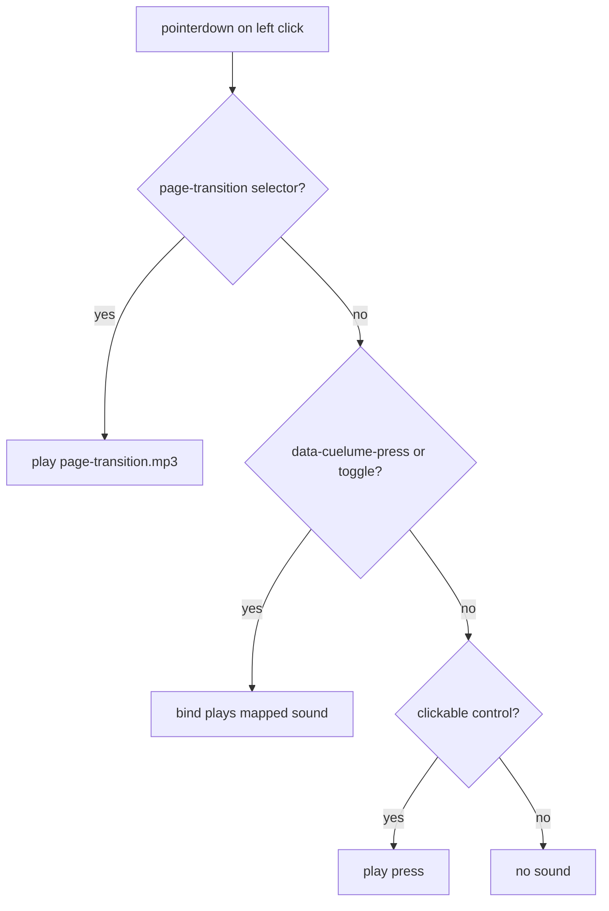

# Add Cuelume interaction sounds

Install [cuelume](https://www.npmjs.com/package/cuelume) and replace the generic click WAV with its synthesized palette. Keep the existing page-transition MP3 for work navigations.

## Sound map

- **press** — any mouse click on a clickable control (buttons, links, tabs, etc.), except the cases below
- **toggle** — [ViewSwitcher](src/components/ViewSwitcher/ViewSwitcher.tsx) options
- **success** — in-flow Connect options (`PromptAction`: Sure, Social Media, In Person, Cool, etc.)
- **arrival** — Connect outbound links (`PromptLink`: LinkedIn, Github, X, Medium, Email, phone)
- **bloom** — Connect left-arrow reset (only when it is actually the left arrow, not the disabled invite state)
- **page-transition.mp3** — unchanged for `.project-card`, `a.list-item[href^="/work/"]`, `.sidebar-nav-back`, `.project-back-mobile`

No hover, release, or mute control unless you ask for them later.

## Wiring

1. `npm install cuelume`

2. Evolve [ClickSound.tsx](src/components/ClickSound/ClickSound.tsx) into the single audio bootstrap:
   - Call `bind()` once in `useEffect` (React recipe from Cuelume)
   - Drop `/assets/click-prompt.wav`
   - Keep the page-transition MP3 path and selector as they are today
   - For other left-click `pointerdown` events, if the target is a clickable control and is **not** already handled by a `data-cuelume-*` attribute or the page-transition selector, call `play("press")`

   Clickable means real controls (`a[href]`, `button:not(:disabled)`, `[role="button"]`, `[role="tab"]`), not empty-page clicks. That is stricter than today’s “any pointerdown anywhere” behavior.

   Skip `play("press")` when `closest("[data-cuelume-press], [data-cuelume-toggle]")` matches, so ViewSwitcher and Connect do not double-fire.

3. Tag specials (Cuelume uses `closest()`, so the attribute goes on the interactive element):

   - [ViewSwitcher.tsx](src/components/ViewSwitcher/ViewSwitcher.tsx) — `data-cuelume-toggle` on each option button
   - [ConnectPrompt.tsx](src/components/ConnectPrompt/ConnectPrompt.tsx)
     - `PromptAction`: `data-cuelume-press="success"`
     - `PromptLink`: `data-cuelume-press="arrival"`
     - Reset button: `data-cuelume-press="bloom"` only when `!isInvite`

`ClickSound` stays mounted in [layout.tsx](src/app/layout.tsx). No new CSS or tokens.

## Verify in the browser

- Generic controls (theme toggle, header avatar, footer links, segmented tabs, gallery close) play **press**
- Clicking empty canvas does **not** play a sound
- ViewSwitcher plays **toggle** only (no extra press)
- Connect in-flow options play **success**; outbound links play **arrival**; left arrow plays **bloom**
- Project cards, work list links, and back links still play the MP3
