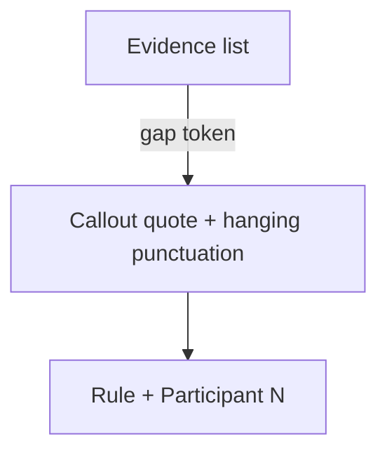

# Evidence quote callout variant

## What changes visually

Existing editorial Callouts (Conversation Insights) stay as they are: left border, hanging quotes, no cite.

Evidence quotes match the reference:

- Serif quote with hanging opening mark (reuse current `.callout-text` / `.callout-quote`)
- No left border on this variant
- Attribution under the quote, right-aligned: short rule + **Participant 2** in sans (primary, semibold)
- Optional `source` after the name (muted) so the same component can do “Anu Atluru, Taste is Eating Silicon Valley” later
- Space between the evidence bullets and the first quote



## Callout API

Extend [`src/components/Callout/Callout.tsx`](src/components/Callout/Callout.tsx):

```ts
type CalloutProps = {
  children: string;
  attribution?: string;
  source?: string;
};
```

- No attribution → current bordered pull-quote (`<aside class="callout">`)
- With attribution → quote variant (`<blockquote class="callout callout--quoted">`) with hanging text plus:

```html
<footer class="callout-attribution">
  <span class="callout-attribution-rule" aria-hidden="true"></span>
  <cite>Participant 2</cite>
  <!-- optional: <span class="callout-attribution-source">, Source</span> -->
</footer>
```

Callout still wraps the body in curly quotes; data strings stay unquoted.

## Tokens (no hardcoded component values)

In [`semantics.css`](src/styles/tokens/semantics.css) (primitives only if a size does not exist):

- Attribution uses sans: `--font-family-sans`, `--text-body-size`, name `--color-text-primary` + `--weight-semibold`, source `--color-text-subtle`
- Rule: hairline height, short width from spacing scale, `--color-border`
- Gaps: quote → cite (~1lh / existing space token); bullets → quotes; quote → quote when stacked

Quote variant CSS in [`Callout.css`](src/components/Callout/Callout.css): no border; attribution row `display: flex; justify-content: flex-end; align-items: center`.

## Data + rendering

Add a reusable quote type on expandable items in [`src/data/projects/types.ts`](src/data/projects/types.ts):

```ts
export type CalloutQuote = {
  text: string;
  attribution: string;
  source?: string;
};

// on ExpandableItemContent
quotes?: CalloutQuote[];
```

In [`architecture-agent.ts`](src/data/projects/architecture-agent.ts):

- Remove `"Quotes:"` and quoted `outro` strings
- Add `quotes` on both Evidence items, e.g. `{ text: "I feel like I've completed the test.", attribution: "Participant 3" }`
- Expand **P2 → Participant 2**, **P4 → Participant 4**

Render in [`ProjectPage.tsx`](src/components/ProjectPage/ProjectPage.tsx) `ExpandableItemBody`: wrap `RichText` + quotes so panel `gap-section` does not swallow the tighter quote spacing. Include `quotes` in `hasExpandableItemBody`.

```tsx
{(item.content || item.quotes?.length) ? (
  <div className="expandable-item-copy">
    {item.content ? <RichText content={item.content} /> : null}
    {item.quotes?.map((quote) => (
      <Callout key={quote.text} attribution={quote.attribution} source={quote.source}>
        {quote.text}
      </Callout>
    ))}
  </div>
) : null}
```

Small CSS on ProjectPage (or ListItem panel child) for `.expandable-item-copy`: column flex, gap = the bullets→quote token.

## Out of scope

Conversation Insights `calloutOne` / `calloutTwo` unchanged. No italic-word markup in these quotes (no words to emphasize).
