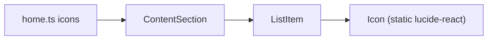
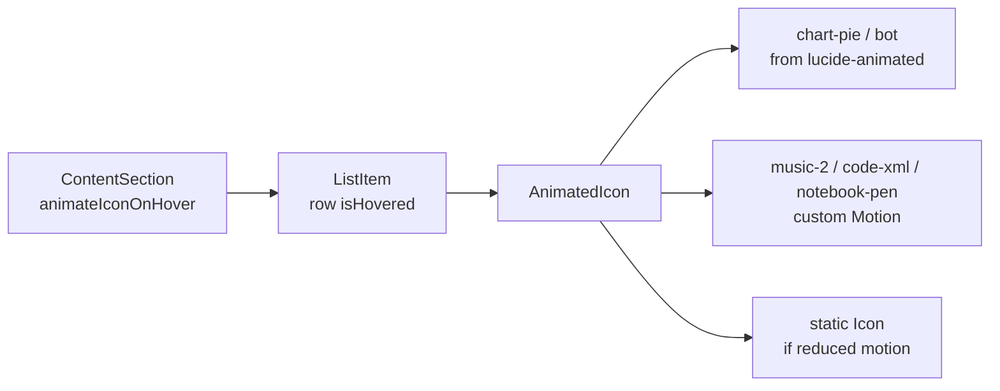

# Home List Icon Hover Animation

## Goal
When a user hovers a **home page list row** (Work tab, list view), the row icon should play a smooth Motion animation in the style of [lucide-animated](https://lucide-animated.com/).

Scope is intentionally narrow:
- **In scope:** Work list rows rendered by [`ContentSection`](src/components/ContentSection/ContentSection.tsx) when `viewMode === "list"`
- **Out of scope:** Card view, About tab (no icons today), project page `ListItem`s, chevrons, view switcher icons

## Current state



Home list icons in [`src/data/home.ts`](src/data/home.ts):
- `chart-pie`, `bot`, `music-2`, `code-xml`, `notebook-pen`

[`ListItem`](src/components/ListItem/ListItem.tsx) already tracks `isHovered`, but only for external links. Internal links and expandable rows do not set hover state today.

[`lucide-animated`](https://lucide-animated.com/) coverage:
- Available: `chart-pie`, `bot`
- Missing: `music-2`, `code-xml`, `notebook-pen` → hand-craft in same style (per your choice)

## Recommended approach

Use lucide-animated as **source**, not as a full dependency install.

Why not `shadcn add @lucide-animated/...` directly:
- Project has no `components.json` / shadcn setup
- Generated icons depend on `cn()` from `@/lib/utils` and default to `size={28}`
- Icons animate on **their own** hover; we need **row-level** hover

Instead, vendor the two available icon sources and adapt them to this codebase.

## Architecture



### 1. Add `AnimatedIcon` layer
Create [`src/components/AnimatedIcon/`](src/components/AnimatedIcon/) with:

- **`AnimatedIcon.tsx`** — registry mapping `IconName` → animated component; falls back to existing [`Icon`](src/components/Icon/Icon.tsx) when:
  - `prefers-reduced-motion` is enabled
  - icon has no animated implementation
- **`icons/chart-pie.tsx`**, **`icons/bot.tsx`** — adapted from lucide-animated registry JSON:
  - Remove `cn()` / shadcn wrapper
  - Default `size={20}` to match current list icons
  - Keep lucide-animated’s controlled API (`startAnimation` / `stopAnimation` via ref)
  - Use `currentColor`, `strokeWidth={2}`, same 24×24 viewBox
- **`icons/music-2.tsx`**, **`icons/code-xml.tsx`**, **`icons/notebook-pen.tsx`** — custom Motion components using the same controlled pattern and subtle path/line transforms (spring or short keyframe loops, matching lucide-animated feel)

Shared helper (optional): `useControlledIconAnimation(ref, isActive)` to call `startAnimation()` / `stopAnimation()` when row hover changes.

### 2. Wire row hover in `ListItem`
Update [`src/components/ListItem/ListItem.tsx`](src/components/ListItem/ListItem.tsx):

- Add prop: `animateIconOnHover?: boolean`
- Track `isHovered` on **all** interactive row types:
  - internal `<Link>`
  - external `<a>`
  - expandable `<button>`
- When `animateIconOnHover && icon`:
  - render `<AnimatedIcon name={icon} isActive={isHovered} />` inside existing `.list-item-icon` wrapper
  - keep current tab-enter `motion.span` wrapper behavior unchanged
- Otherwise keep current static `<Icon />` path

### 3. Enable only on home list view
Update [`src/components/ContentSection/ContentSection.tsx`](src/components/ContentSection/ContentSection.tsx):

```tsx
<ListItem
  ...
  animateIconOnHover={viewMode === "list"}
/>
```

No changes needed in [`ProjectPage`](src/components/ProjectPage/ProjectPage.tsx) — those list items won’t pass the flag.

### 4. Styling consistency
- Reuse existing [`.list-item-icon`](src/components/ListItem/ListItem.css) sizing (`var(--icon-size)`, 20px)
- Reuse existing icon color token via `currentColor` / `.icon { color: var(--color-text-label) }`
- No Tailwind classes; no new global tokens unless a shared motion constant is useful in [`src/motion/`](src/motion/)

### 5. Accessibility
- Respect `useReducedMotion()` (same pattern as [`ContentSection`](src/components/ContentSection/ContentSection.tsx) and [`PageEnter`](src/components/PageEnter/PageEnter.tsx))
- Icons remain `aria-hidden`; row semantics unchanged

## Files to touch

| Action | File |
|--------|------|
| Create | `src/components/AnimatedIcon/AnimatedIcon.tsx` |
| Create | `src/components/AnimatedIcon/icons/chart-pie.tsx` |
| Create | `src/components/AnimatedIcon/icons/bot.tsx` |
| Create | `src/components/AnimatedIcon/icons/music-2.tsx` |
| Create | `src/components/AnimatedIcon/icons/code-xml.tsx` |
| Create | `src/components/AnimatedIcon/icons/notebook-pen.tsx` |
| Modify | `src/components/ListItem/ListItem.tsx` |
| Modify | `src/components/ContentSection/ContentSection.tsx` |

No new npm packages — `motion` is already installed.

## Test plan
- Home → Work → List view: hover each of the 6 rows; each icon animates once per hover
- Move pointer across row (not just icon): animation still triggers
- Switch to Card view: icons should not animate on hover
- About tab list rows: unchanged (no icons)
- Project pages: list/expandable icons remain static
- Enable reduced motion in OS/browser: icons stay static
