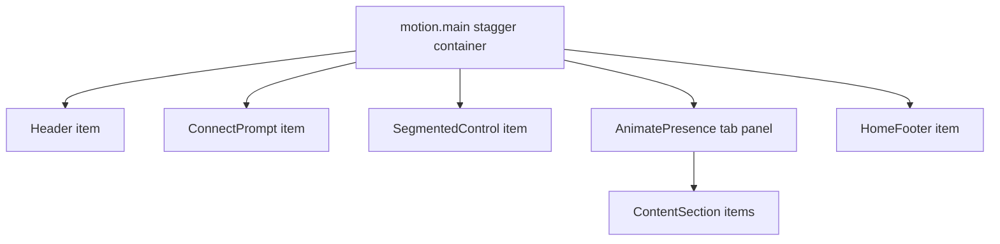

# Home page load stagger animation

## Goal

On first visit to the home page, blocks appear in sequence with a short delay between each:

- Start: `opacity: 0`, `blur(8px)`, `translateY(40px)`
- End: `opacity: 1`, `blur(0)`, `translateY(0)`

This animation appears only once when the website is loaded. This is applicable to work tab elements only. Tab switching (Work / About) keeps the current fast blur transition — no re-stagger, no 40px slide.  
  
YOU CANNOT CHANGE WHATEVER IS DONE UNTIL NOW. DON'T DELETE ANYTHING DONE SO FAR.

## Animation units (stagger order)

Each item is one stagger step in `[HomePage.tsx](src/components/HomePage/HomePage.tsx)`:

1. Header
2. ConnectPrompt
3. SegmentedControl
4. Each `ContentSection` in the active tab (Industry Projects, Personal Projects, etc.)
5. HomeFooter

Footer keeps its existing scroll-triggered letter animation; load stagger only handles the block fading/sliding in.

## New motion module

Add `[src/motion/homeEntrance.ts](src/motion/homeEntrance.ts)`:

```ts
export const homeEntranceContainer = {
  hidden: {},
  visible: {
    transition: {
      staggerChildren: 0.08,
      delayChildren: 0.04,
    },
  },
};

export const homeEntranceItem = {
  hidden: { opacity: 0, filter: "blur(8px)", y: 40 },
  visible: {
    opacity: 1,
    filter: "blur(0px)",
    y: 0,
    transition: { duration: 0.45, ease: "easeOut" },
  },
};
```

Reuse the same blur amount as `[tabContent.ts](src/motion/tabContent.ts)` for visual consistency.

Respect `useReducedMotion`: skip animation and render final state immediately.

## Wiring in HomePage

Update `[src/components/HomePage/HomePage.tsx](src/components/HomePage/HomePage.tsx)`:




- Wrap `.home-body` in a `motion.main` with `variants={homeEntranceContainer}`, `initial="hidden"`, `animate="visible"`.
- Wrap Header, ConnectPrompt, SegmentedControl, HomeFooter each in `motion.div variants={homeEntranceItem}`.
- Wrap each `ContentSection` in `motion.div variants={homeEntranceItem}` inside the tab panel.

## Tab switch isolation

Track first load vs tab change with a ref:

```ts
const hasSwitchedTab = useRef(false);

const handleTabChange = (tab: HomeTab) => {
  hasSwitchedTab.current = true;
  setActiveTab(tab);
};
```

- **Initial load:** sections use `homeEntranceItem` stagger from the parent container.
- **After tab switch:** sections render without entrance variants (`initial={false}`), and the existing `AnimatePresence` + `tabContentBlurVariants` on `.home-content` handles the swap.

This prevents About tab sections from replaying the load cascade.

## No changes needed elsewhere

- `[ContentSection.tsx](src/components/ContentSection/ContentSection.tsx)` and `[ListItem.tsx](src/components/ListItem/ListItem.tsx)` stay as-is; block-level stagger is enough and avoids animating 15+ list rows individually.
- No new CSS files; Motion handles transforms/filters inline.
- No changes to `[HomePage.css](src/components/HomePage/HomePage.css)` unless a wrapper causes layout issues (unlikely with `motion.div` as block).

## Timing defaults (tunable)


| Constant          | Value   |
| ----------------- | ------- |
| `staggerChildren` | 0.08s   |
| `delayChildren`   | 0.04s   |
| Item duration     | 0.45s   |
| `y` offset        | 40px    |
| Blur              | 8px → 0 |


