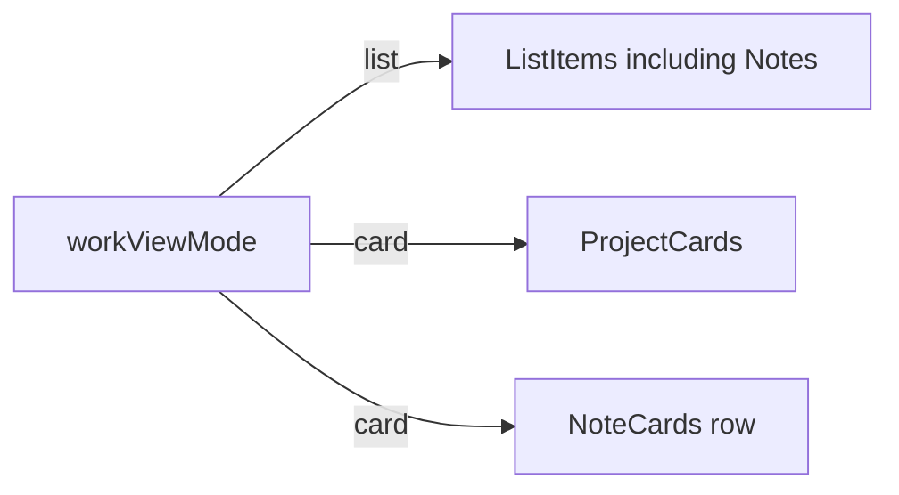

# Home notes cards (card view)

G1 PASS — node `542:8033`: two portrait note cards in a row. Each has a lighter offset backing, a colored face with top/bottom accent caps, a short rule, white title, “Medium” source, and Caveat handwritten blurb. No images.

G2–G4 (apply during implementation) — Next.js App Router + per-component CSS (no Tailwind). Reuse Work-tab card-view wiring in [`ContentSection.tsx`](src/components/ContentSection/ContentSection.tsx), home width `--content-width-home` (40rem), handwritten `--font-family-hand`, and the DataAttributeCards tone pattern. New Figma greens/blues become oklch primitives → semantic note roles; spacing/type reuse existing tokens.

## Placement

On the Work tab, **card view only** (confirmed):

- Work / Personal: existing [`ProjectCard`](src/components/ProjectCard/ProjectCard.tsx) stack (unchanged)
- Notes (`writing` in [`home.ts`](src/data/home.ts)): new side-by-side [`NoteCards`](src/components/NoteCards/NoteCards.tsx) row
- List view: keep current [`ListItem`](src/components/ListItem/ListItem.tsx) links

Default Work view is already `"card"`, so this is the primary home-page look.



## Component

Add [`src/components/NoteCards/NoteCards.tsx`](src/components/NoteCards/NoteCards.tsx) + [`NoteCards.css`](src/components/NoteCards/NoteCards.css).

Structure:

```tsx
<ul className="note-cards">
  {notes.map((note) => (
    <li key={note.id} className={`note-card-stack note-card-stack--${note.tone}`}>
      <span className="note-card-backing" aria-hidden="true" />
      <a className="note-card" href={note.href} target="_blank" rel="noopener noreferrer">
        <div className="note-card-top">
          <span className="note-card-rule" />
          <p className="note-card-title">{note.title}</p>
          <p className="note-card-source">{note.source}</p>
        </div>
        <p className="note-card-description">{note.description}</p>
      </a>
    </li>
  ))}
</ul>
```

Visual from Figma, adapted to this codebase:

- **Stack:** CSS grid overlay. Backing is the same size as the face, shifted slightly right/down (reuse `--space-12`) in a lighter color so the “second sheet” peeks out. Face sits on top.
- **Face:** surface fill, top/bottom accent caps (~10.6px → new size token, same role as data-attribute stripes), short rounded rule (reuse `--size-data-attribute-rule-*`).
- **Type:** title = `--font-family-sans` + new `--font-size-28` / `--line-height-32` / bold / white. Source = Libre Baskerville (already loaded as `--font-libre-baskerville`) + `--text-body-size` / `--weight-medium` / accent. Blurb = `--font-family-hand` + `--font-size-20` / white.
- **Layout inside card:** column, space-between; padding `--space-24` inline / `--space-40` block; min-height so both cards match (~27.5rem).
- **Corners:** square, matching Figma (do not round like project cards).
- **Hover:** `rotate: 3deg` on the face (`--rotate-note-card-hover`), with `--transition-fast`. Disable under `prefers-reduced-motion`. Keep overflow visible on the stack/section so the rotate and backing are not clipped.
- **Dark mode:** keep these product colors (same as DataAttributeCards). Do not invert with theme.

No assets to download.

## Layout (responsive)

Stay **inside** `--content-width-home` (40rem). Do **not** bleed like DataAttributeCards. User asked to fill home page width.

- Desktop / tablet: one row, `grid-template-columns: repeat(auto-fit, minmax(min(100%, 12rem), 1fr))`, gap `--space-24`, width 100%
- Mobile `≤ 39.9375rem`: 1 column so cards are not ~160px wide

`auto-fit` keeps two notes side-by-side today and lets a future third wrap instead of crushing.

## Per-note colors

Each note owns a **tone**. Adding a future note means adding a new tone + primitives + a CSS modifier — not cycling a shared palette.

Figma hex → oklch primitives (do not leave hex in CSS):

- Interface (green): surface `#00aa64`, accent/stripe `#7bdd6c`, copy/rule `#9effc3`, backing `#dcffd6`
- Self (blue): surface `#005ce7`, accent `#5d96ff`, copy `#9ec0ff`, backing `#b6d0ff`

Semantic roles in [`semantics.css`](src/styles/tokens/semantics.css), e.g.:

- `--color-note-interface-surface` / `-accent` / `-copy` / `-backing`
- `--color-note-self-surface` / `-accent` / `-copy` / `-backing`
- `--color-note-title` → `--color-white`
- `--rotate-note-card-hover` → `--rotate-3` (`3deg` primitive)
- padding, gap, min-height, stripe thickness

Modifiers on the stack set local `--color-note-surface` etc., same pattern as [`.data-attribute-card--insight`](src/components/DataAttributeCards/DataAttributeCards.css). Component CSS only uses those local semantic roles.

Reuse existing tokens for everything else: `--gap-xl` (rule→title), `--space-24` / `--space-40`, `--font-family-sans` / `--font-family-hand`, `--text-body-size`, `--weight-medium`, `--font-weight-bold`, `--color-white`, data-attribute rule sizes, `--transition-fast`.

## Data and wiring

In [`home.ts`](src/data/home.ts):

- Add `cardType?: "project" | "note"` to `ContentSectionData`
- Set `supportsCardView: true` and `cardType: "note"` on the `writing` section
- Extend writing items with card fields (list `title`/`href` stay as they are):

```ts
{
  id: "designing-beyond-the-interface",
  title: "Designing Beyond the Interface",
  cardTitle: "Designing beyond the interface",
  source: "Medium",
  description: "Something I wrote for my HCDE 501 class taught by Dr. Mark Zachry",
  tone: "interface",
  href: "...",
}
{
  id: "note-to-myself",
  title: "A Note to Myself",
  cardTitle: "An ever evolving note to myself",
  source: "Medium",
  description: "Just some reflections about who I am and where wanna be. This will probably evolve lol",
  tone: "self",
  href: "...",
}
```

In [`ContentSection.tsx`](src/components/ContentSection/ContentSection.tsx): when `showCardView && section.cardType === "note"`, render `<NoteCards>` as one row (not the vertical `.content-section-cards` used by projects). Project card path stays behind `cardType !== "note"` (default `"project"`).

## Verify

On `/`, Work tab, **card** view:

- Notes are two equal-width colored cards in one row, full 40rem home column, stacked backing visible
- Hover rotates the face 3°; reduced-motion does not
- Links open the existing Medium URLs in a new tab
- Desktop ~1440 / laptop ~1024: row of two
- Mobile ~375: stacked column, no horizontal scroll
- List view: Notes still list items
- Light and dark: green/blue tiles unchanged; page chrome still themes
