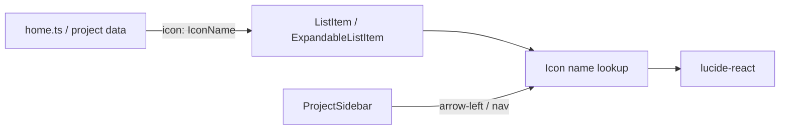

# Lucide icon migration

## Figma source

The Icons component ([node `128:333`](https://www.figma.com/design/7SObhe2tsBTV67x9WcOPsp/Portfolio?node-id=128-333)) exposes these Lucide variant names:

`message-circle-more`, `bot`, `music-2`, `chart-pie`, `code-xml`, `x`, `book-open-text`, `briefcase`, `sprout`, `chevron-down`, `footprints`, `arrow-left`, `users`, `bug`, `database`, `chevron-right`

## Current → Lucide mapping (existing usages)

| Current asset | Lucide name |
|---|---|
| `discovery-responses.svg` | `message-circle-more` |
| `conversation-insights.svg` | `chart-pie` |
| `architecture-agent.svg` | `bot` |
| `digital-footprints.svg` | `footprints` |
| `kar-no-key.svg` | `music-2` |
| `gz-lang.svg` | `code-xml` |
| `users.svg` | `users` |
| `data.svg` | `database` |
| `analyze.svg` / `insights.svg` | `bug` |
| `chevron-right.svg` | `chevron-right` |
| `chevron-down.svg` | `chevron-down` |
| `back.svg` | `arrow-left` |

Unused in app today (still registered for parity with Figma): `x`, `book-open-text`, `briefcase`, `sprout`. About-tab list items stay icon-less unless you later ask to add them.

## Approach

1. **Install** `lucide-react`.

2. **Add** [`src/components/Icon/Icon.tsx`](src/components/Icon/Icon.tsx) + [`Icon.css`](src/components/Icon/Icon.css):
   - Typed `IconName` union matching Figma kebab-case names
   - Lookup map to Lucide components (`MessageCircleMore`, `Bot`, `Music2`, `ChartPie`, `CodeXml`, `X`, `BookOpenText`, `Briefcase`, `Sprout`, `ChevronDown`, `Footprints`, `ArrowLeft`, `Users`, `Bug`, `Database`, `ChevronRight`)
   - Render at `size={20}` (`--size-icon`), `aria-hidden`, `currentColor`
   - Color via CSS: `color: var(--color-text-label)` (`#a3a3a3`, matches existing SVG fills)

3. **Change data types** from path strings to icon names:
   - [`src/data/home.ts`](src/data/home.ts): `icon?: IconName`; update work/writing items per mapping above
   - [`src/data/projects/types.ts`](src/data/projects/types.ts): `icon: IconName` on expandable items
   - [`src/data/projects/conversation-insights.ts`](src/data/projects/conversation-insights.ts): `users`, `database`, `bug`, `bug`

4. **Update UI components** to render `<Icon name={...} />` instead of ``:
   - [`ListItem.tsx`](src/components/ListItem/ListItem.tsx) — item icon + hardcoded chevron-right
   - [`ExpandableListItem.tsx`](src/components/ExpandableListItem/ExpandableListItem.tsx) — item icon + chevron-down
   - [`ProjectSidebar.tsx`](src/components/ProjectSidebar/ProjectSidebar.tsx) — back arrow-left
   - CSS: swap `img` sizing rules for `svg` in ListItem / ExpandableListItem / ProjectSidebar styles

5. **Remove obsolete UI SVGs** under `public/assets/icons/` and `public/assets/projects/conversation-insights/icons/` (project diagram PNGs stay).

