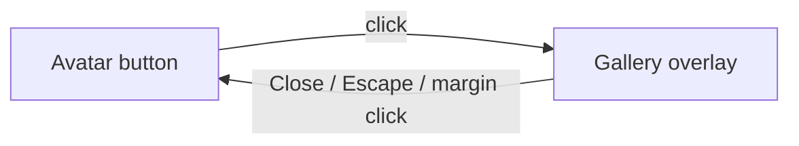

# Photo gallery bento overlay

## Behavior

Clicking the existing avatar button in [`Header.tsx`](src/components/Header/Header.tsx) opens a full-screen overlay. Photos are **display-only** (no lightbox). Close via the frosted **Close** button, **Escape**, or a click on the **20px page gap** around the sheet.

## Overlay chrome

Render the overlay as a **sibling of `PageEnter`** in [`HomePage.tsx`](src/components/HomePage/HomePage.tsx) (not inside Header’s motion wrapper) so `position: fixed` is not trapped by Motion transforms.

- Root: `position: fixed; inset: 0` with a high z-index (above ThemeToggle’s `3`). The transparent root is the click-to-close hit target.
- Sheet: inset `--space-20` (1.25rem / 20px) on all sides. Background: **neutral-800 with alpha + `backdrop-filter`**, so the home page is visible in the margin *and* softly through the sheet. Always use `--color-neutral-800` (not theme `--color-bg-surface`, which is white in light mode).
- Title **Life so far**: absolutely centered at the top of the sheet, sitting **on** the top blur band (higher z-index than the blur).
- **Close**: absolutely centered at the bottom of the sheet, on the bottom blur band. Frosted glass: translucent fill + `backdrop-filter` + hairline border. Light label so it reads on the dark sheet in both themes.

Internal stack inside the sheet:

1. Scrollable bento
2. Contained `ViewportEdgeBlur`
3. Title + Close (above blur)

## Reuse `ViewportEdgeBlur`

[`ViewportEdgeBlur`](src/components/ViewportEdgeBlur/ViewportEdgeBlur.tsx) is `position: fixed; inset: 0` today, so it cannot sit inside an inset sheet as-is.

Add a `contained` prop:

- Default (home/project pages): unchanged (`fixed`, viewport, `z-index: 1`)
- `contained`: `position: absolute; inset: 0` relative to the sheet, `pointer-events: none`, local z-index so bands blur the scrolling photos at the sheet’s top and bottom

Page-level `ViewportEdgeBlur` stays mounted; the 20px gap will still show the real page (including its own edge blur).

## Motion (`motion/react`)

New variants in [`src/motion/photoGallery.ts`](src/motion/photoGallery.ts), same ease as page/sidebar (`[0.16, 1, 0.3, 1]`), **same duration, no stagger** so both tracks run together.

| Layer | Enter | Exit |
|---|---|---|
| Sheet | `y: 100% → 0` | reverse |
| Image grid | `y: negative offset → 0` (top → bottom) | reverse |

`AnimatePresence` on the overlay. `useReducedMotion`: opacity only, no slides.

Lock `html`/`body` overflow while open (home currently scrolls on `html:has(.home-page)`). Restore focus to the avatar on close. `role="dialog"` + `aria-modal="true"` + `aria-labelledby` on the title.

## Bento grid

24 files in [`public/assets/photo-gallery/`](public/assets/photo-gallery/). New data module [`src/data/photo-gallery.ts`](src/data/photo-gallery.ts) listing `src`, `alt` (from filenames), and a span role (`square` / `wide` / `tall` / `hero`).

Layout (CSS Grid, `grid-auto-flow: dense`, `object-fit: cover` so mixed dimensions work):

- Desktop: 4 columns
- Tablet (`max-width: 68.6875rem`): 3 columns
- Mobile (`max-width: 39.9375rem`): 2 columns (bento stays a grid, not a single stack)

Cells use `next/image` with `fill`. Grid is the only scroller; title and Close stay pinned.

## Wiring

- [`Header.tsx`](src/components/Header/Header.tsx): `onAvatarClick`, `aria-expanded`, `aria-haspopup="dialog"`, label like “Open photo gallery”.
- [`HomePage.tsx`](src/components/HomePage/HomePage.tsx): `galleryOpen` state; overlay sibling of `PageEnter`.
- New components (plain CSS, no Tailwind):
  - `PhotoGalleryOverlay/` — sheet, title, close, animations, a11y
  - `PhotoBentoGrid/` — grid + cells

## Tokens ([`primitives.css`](src/styles/tokens/primitives.css) → [`semantics.css`](src/styles/tokens/semantics.css))

No hardcoded colors/spacing in component CSS. Add roles such as:

- `--inset-photo-gallery` → `--space-20`
- `--color-photo-gallery-overlay` → `--color-neutral-800` (with alpha via a dedicated overlay token)
- `--color-photo-gallery-text` → `--color-white`
- `--blur-photo-gallery-overlay`
- `--z-photo-gallery` (new z-index primitive; none exist today)
- Frosted close surface / border tokens

## Responsive + verification

Follow the portfolio responsive skill: no overflow, 44px-class tap target on Close, title wraps if needed. Verify overlay open/close (button, Escape, margin click), opposing enter/exit motion, scroll under edge blurs, and viewports ~1440 / 1024 / 768 / 390.
