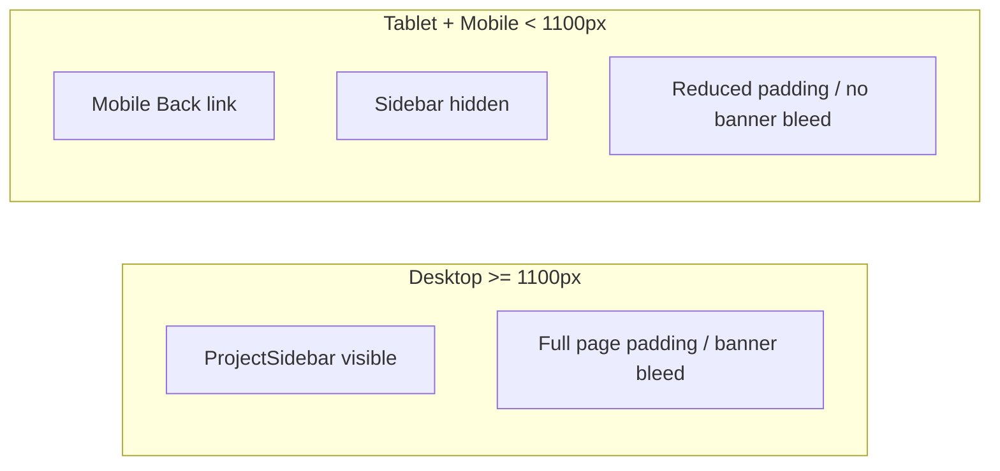

# Portfolio responsive layout

## Current state

- **Breakpoint tokens** already exist in [`primitives.css`](src/styles/tokens/primitives.css): `--breakpoint-sidebar` (68.75rem / 1100px), `--breakpoint-footer-sm` (40rem / 640px).
- **Project sidebar** already hides below 1100px via [`ProjectSidebar.css`](src/components/ProjectSidebar/ProjectSidebar.css) — aligns with the [responsive-portfolio skill](file:///Users/nimeshmohanakrishnan/.cursor/skills/responsive-portfolio-skill/SKILL.md).
- **No responsive spacing scale**: `--padding-page`, `--gap-page`, `--gap-intro`, and banner offsets use `7.5rem` everywhere — causes excessive whitespace on tablet/mobile and **horizontal overflow** from [`ProjectBanner.css`](src/components/ProjectBanner/ProjectBanner.css) (`width: calc(100% + 2 * bleed)` + negative margins).
- **Functional gap**: Back navigation only exists inside the hidden sidebar ([`ProjectSidebar.tsx`](src/components/ProjectSidebar/ProjectSidebar.tsx)) — broken on tablet/mobile until we add a mobile Back link (user confirmed: **Back only, top-left**).

## Strategy (skill-aligned)

1. **Token-driven spacing** — override semantic layout tokens in media queries (primitive → semantic → component). No new frameworks.
2. **CSS over duplicate components** — one `ProjectPage` layout; show/hide Back via CSS at breakpoints.
3. **Preserve desktop** — default `:root` values stay as-is; compact overrides only below breakpoints.
4. **Fluid media** — banners/images/videos stay `width: 100%`, `max-width: 100%`, `height: auto` where hugging; fixed hero height scales down on small screens.

## 1. Responsive semantic tokens

Add a new file [`src/styles/tokens/responsive.css`](src/styles/tokens/responsive.css) and import it after semantics in [`globals.css`](src/app/globals.css).

Use existing breakpoint variables in queries:

| Breakpoint | Query | Purpose |
|---|---|---|
| Compact (tablet + mobile) | `max-width: calc(var(--breakpoint-sidebar) - 0.0625rem)` | Sidebar hidden zone; primary layout reflow |
| Small mobile | `max-width: calc(var(--breakpoint-footer-sm) - 0.0625rem)` | Extra tightening |

**Compact overrides** (suggested targets — tune visually during validation):

- `--padding-page`: `var(--space-48)` → `var(--space-32)` on small mobile
- `--gap-intro`, `--gap-page`: `var(--space-80)` → `var(--space-48)` on small mobile
- `--scroll-margin-section`: match reduced `--gap-page`
- `--offset-banner-inline`: `0`
- `--offset-banner-bleed`: `0`
- `--banner-height`: `22rem` compact / `18rem` small mobile
- `--card-banner-height`: `18rem` compact / `14rem` small mobile
- `--inset-x`: keep `var(--space-12)` or bump to `var(--space-16)` on smallest screens for readability

This single layer fixes [`HomePage.css`](src/components/HomePage/HomePage.css), [`ProjectPage.css`](src/components/ProjectPage/ProjectPage.css), [`ProjectSection.css`](src/components/ProjectSection/ProjectSection.css), list panels, callouts, etc. without per-file padding hacks.

## 2. Project banner overflow

In [`ProjectBanner.css`](src/components/ProjectBanner/ProjectBanner.css), ensure compact breakpoints:

- Default page banner uses token offsets (zeroed in responsive.css) so bleed math becomes safe.
- Add explicit compact rules as backup: `width: 100%`, `margin-inline: 0`, `align-self: stretch` for non-card banners below sidebar breakpoint.
- `--hug` banners already static-position media — verify no overflow after token changes.
- Card variant (`project-banner--card`) already `width: 100%` — no bleed.

## 3. Mobile Back link (project pages)

In [`ProjectPage.tsx`](src/components/ProjectPage/ProjectPage.tsx):

- Add a `Link` to `/` with chevron + “Back”, placed **above** `project-intro` inside `project-body`.
- Class: `project-back-mobile` — visible only below sidebar breakpoint.

In [`ProjectPage.css`](src/components/ProjectPage/ProjectPage.css):

- Style to match sidebar back link (reuse sidebar text tokens: `--text-sidebar-size`, `--color-text-label`, `--gap-xs` icon gap, `--inset-x` padding).
- `display: none` by default; `display: flex` below sidebar breakpoint.
- Top-left alignment within content column (no full-width bar unless needed).

Sidebar Back remains on desktop; no duplicate visible at `>= 1100px`.

## 4. Component-level adjustments

Small targeted CSS only where tokens alone are insufficient:

| Component | Change |
|---|---|
| [`HomePage.css`](src/components/HomePage/HomePage.css) | `home-nav`: `flex-wrap: wrap`, `gap: var(--gap-md)` below compact breakpoint so tabs + view switcher never collide |
| [`SegmentedControl.css`](src/components/SegmentedControl/SegmentedControl.css) | Below compact: `width: 100%` (or `min-width: 0; flex: 1`) when nav wraps |
| [`ProjectCard.css`](src/components/ProjectCard/ProjectCard.css) | Below compact: allow `project-card-type` to shrink (`min-width: 0`, optional `white-space: normal`) to prevent header overflow |
| [`Header.css`](src/components/Header/Header.css) | Optional: slightly reduce display title via semantic token override on small mobile (only if clipping observed) |
| [`ListItem.css`](src/components/ListItem/ListItem.css) | Ensure expandable rows meet comfortable tap height (padding already ~16px+ — verify min 44px touch target) |
| [`ProjectSidebar.css`](src/components/ProjectSidebar/ProjectSidebar.css) | Replace hardcoded `68.75rem` with `var(--layout-breakpoint-sidebar)` for consistency |

No JS breakpoint logic unless needed for interactions (card hover focus was removed from codebase).

## 5. Global safeguards

In [`globals.css`](src/app/globals.css):

- Confirm `overflow-x: hidden` on `html, body` (already present).
- Add `video { max-width: 100% }` if not covered by banner rules.

## 6. Validation (skill checklist)

Manual pass at:

- **1440px** — desktop layout unchanged; sidebar + full spacing + banner bleed
- **1024px** — sidebar hidden; Back visible; no horizontal scroll; banner contained
- **768px** — same; home nav wraps cleanly; project cards readable
- **375px** — single-column; text wraps; images/videos contained; tap targets usable

Pages: home (list + card views, Work + About tabs), `/work/conversation-insights` (long case study, videos, expandable sections).

## Files to touch

| File | Action |
|---|---|
| [`src/styles/tokens/responsive.css`](src/styles/tokens/responsive.css) | **New** — breakpoint overrides for semantic spacing/media tokens |
| [`src/app/globals.css`](src/app/globals.css) | Import responsive tokens |
| [`src/components/ProjectPage/ProjectPage.tsx`](src/components/ProjectPage/ProjectPage.tsx) | Mobile Back link |
| [`src/components/ProjectPage/ProjectPage.css`](src/components/ProjectPage/ProjectPage.css) | Back link + any page-specific compact rules |
| [`src/components/ProjectBanner/ProjectBanner.css`](src/components/ProjectBanner/ProjectBanner.css) | Compact banner containment |
| [`src/components/HomePage/HomePage.css`](src/components/HomePage/HomePage.css) | Nav wrap |
| [`src/components/SegmentedControl/SegmentedControl.css`](src/components/SegmentedControl/SegmentedControl.css) | Full-width on compact |
| [`src/components/ProjectCard/ProjectCard.css`](src/components/ProjectCard/ProjectCard.css) | Header overflow fix |
| [`src/components/ProjectSidebar/ProjectSidebar.css`](src/components/ProjectSidebar/ProjectSidebar.css) | Use token breakpoint variable |

## Out of scope (per user)

- Mobile section nav / jump links on project pages
- New dependencies or layout rewrites
- Content changes

## Definition of done

Matches skill + user choices:

- Intentional layout at desktop / tablet / mobile
- Sidebar hidden below 1100px; **Back link top-left** on project pages in that range
- No horizontal scrolling; media scales correctly
- Typography and identity preserved; spacing scales via tokens
- Future components inherit responsive spacing by using semantic tokens
