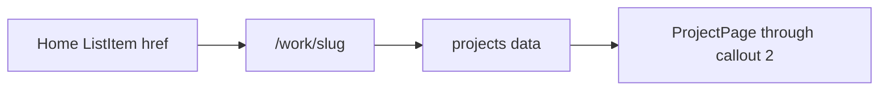

# Project page through second callout

## Design readout (Conversation Insights, node `195:753`)

Centered **700px** column (`px 12`, `py 120`) with **80px** gap between major blocks. Sticky left sidebar (`180px`, `gap 20`) sits outside the column.

**Implement through second callout only** (stop before Constraints):

1. **Header** — title 28/32 semibold black; subtitle 18/28 medium `neutral-350`; gap **16** between them; inset `px 12`
2. **Banner** — `h ~436`, `p 12`, `radius 8`, fill `neutral-100`, border `neutral-200`, hero image inside
3. **Overview** — heading 20/32 semibold black; body 18/28 regular `neutral-500`; section gap **20**; inset `px 12`
4. **Problem** — eyebrow 16 medium `neutral-400` + title 20/32 semibold (gap **8**); body 18/28 `neutral-500`; diagram image; block stack gap **40**
5. **Callout 1** — top/bottom border **4px** `blue/dark-blue-2` (`#60a5fa`); text 22/32 semibold `blue/dark-blue` (`#2679f3`), centered; `py 40` / `px 12`
6. **Discovery & Insights** — same heading pattern as Problem; intro body; then expandable list
7. **Callout 2** — same callout component/styles as #1

**Expandable list item states** (`195:1316`):

| State | Background | Label | Notes |
|-------|------------|-------|-------|
| Default | white | `neutral-600` | chevron-down, leading icon |
| Hover | `neutral-50` | black | |
| Active | white | black | panel open below |

Row: `gap 12`, `px 12` / `py 16`, `radius 4`, icon/chevron `20`. Expanded panel: `pt 12` / `pb 20` / `px 12`, body 18/28 `neutral-500`; media blocks use gap **40** under text. Items toggle independently (start collapsed).

**Sidebar (in scope):** Back → `/`; in-page anchors for Overview, Problem, Discovery & Insights only (later sections omitted until built).

---

## Token plan

### Reuse as-is
`neutral-50/100/200/350/400/500/600`, white/black, `--space-8/12/16/20`, `--list-item-padding-*`, `--list-item-gap`, `--size-icon`, `--letter-spacing-body`, `--color-border-subtle` (hover bg), `--color-text-primary/secondary/muted/subtle`, `--page-padding-x`, `--page-content-width`

### Add primitives
- `--color-blue-600: #2679f3`, `--color-blue-400: #60a5fa`
- `--font-size-22`, `--font-size-28`, `--line-height-28`
- `--space-40`, `--space-80`, `--space-120` (Figma body `py 120`)
- `--radius-8`, `--size-border-callout: 4px`, `--size-sidebar-width: 180px`

### Add semantics (purpose aliases only)
- `--color-accent` → blue-600; `--color-accent-soft` → blue-400
- `--color-text-label` → neutral-400 (project eyebrows / sidebar)
- `--color-text-body` → neutral-500 (paragraphs)
- Typography roles: `--text-project-title-*` (28/32/semibold), `--text-project-subtitle-*` (18/28/medium), `--text-section-heading-*` (20/32/semibold), `--text-body-*` (18/28/regular), `--text-callout-*` (22/32/semibold)
- Layout: `--project-section-gap: space-80`, `--project-block-gap: space-40`, `--project-heading-gap: space-8`, `--project-overview-gap: space-20`, `--project-title-gap: space-16`, `--callout-padding-y: space-40`, `--callout-border-width`, `--banner-radius: radius-8`, `--expandable-panel-padding-top/bottom`, `--sidebar-width`, `--sidebar-gap: space-20`, `--sidebar-item-padding-y: space-8`

Components reference **semantics only**.

---

## Routing and data

- Add [`src/app/work/[slug]/page.tsx`](src/app/work/[slug]/page.tsx) with `generateStaticParams` for known slugs
- Add [`src/data/projects/conversation-insights.ts`](src/data/projects/conversation-insights.ts) (copy + section structure through callout 2)
- Registry [`src/data/projects/index.ts`](src/data/projects/index.ts); unknown slug → `notFound()`
- Update [`src/data/home.ts`](src/data/home.ts): Work project `href`s → `/work/{id}` (industry + personal). About/writing stay `#` for now

---

## Components (plain CSS, co-located)

| Component | Role |
|-----------|------|
| `ProjectSidebar` | Back + section links; sticky on desktop, hidden/collapsed on narrow viewports |
| `ProjectHeader` | Title + subtitle |
| `ProjectBanner` | Framed hero image |
| `ProjectSection` | Optional eyebrow + heading + children |
| `Callout` | Accent top/bottom border quote |
| `ExpandableListItem` | New client accordion row (do **not** overload home `ListItem`, which remains a link + chevron-right) |
| `ProjectPage` | Composes sections for a project |

Export Figma assets into `public/assets/projects/conversation-insights/` (banner, problem diagram, insight diagrams, expandable leading icons, chevron-down, back arrow).

---

## Out of scope
- Content after callout 2 (Constraints onward)
- Sidebar links to unimplemented sections
- About / writing detail pages
- Zalando Sans / dark mode
