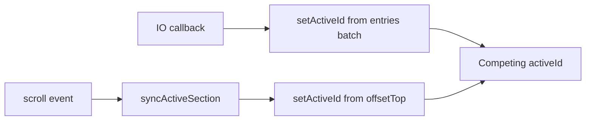

# Project sidebar scroll spy

## Problem

[`ProjectSidebar.tsx`](src/components/ProjectSidebar/ProjectSidebar.tsx) updates `activeId` from **two** systems with different rules:

- `IntersectionObserver` (`rootMargin: "-20% 0px -55% 0px"`, thresholds `0 / 0.1 / 0.25`)
- `window` `scroll` → `getActiveSectionId()` using `offsetTop` at `scrollY + 20vh`

They race on every scroll → sidebar highlight flickers between adjacent sections.



## Approach

**One scroll spy only:** RAF-throttled scroll/resize handler + `getBoundingClientRect()` for section positions. Remove `IntersectionObserver` entirely.

Designed to stay stable when you add project page blur enter/exit later via an optional **pause** flag.

## Implementation

### 1. Add shared scroll-spy helpers

New file [`src/motion/projectScrollSpy.ts`](src/motion/projectScrollSpy.ts) (or `src/lib/projectScrollSpy.ts`):

```ts
export const PROJECT_SCROLL_SPY_OFFSET_RATIO = 0.2; // matches current 20vh marker

export function getSectionElements(ids: string[]): HTMLElement[] { ... }

export function getActiveSectionId(
  elements: HTMLElement[],
  offsetRatio = PROJECT_SCROLL_SPY_OFFSET_RATIO,
): string {
  const marker = window.scrollY + window.innerHeight * offsetRatio;
  let activeId = elements[0]?.id ?? "";

  for (const element of elements) {
    const top = element.getBoundingClientRect().top + window.scrollY;
    if (top <= marker) {
      activeId = element.id;
    }
  }

  return activeId;
}
```

Keep helpers pure (no React) so they are easy to test and reuse.

### 2. Add `useProjectScrollSpy` hook

Same file or [`src/motion/useProjectScrollSpy.ts`](src/motion/useProjectScrollSpy.ts):

| Behavior | Detail |
|----------|--------|
| Input | `sectionIds: string[]` (only ids with matching DOM sections) |
| RAF throttle | On `scroll` + `resize`, schedule one `requestAnimationFrame` sync; cancel pending frame on cleanup |
| Skip redundant updates | `setActiveId` only when computed id **changed** |
| Pause | `enabled: boolean` prop — when `false`, do not attach listeners or update state (for enter animation) |
| Initial sync | One sync when `enabled` becomes `true` (after enter completes) |
| Cleanup | Remove listeners + cancel RAF on unmount |

```ts
type UseProjectScrollSpyOptions = {
  sectionIds: string[];
  enabled?: boolean;
};

export function useProjectScrollSpy({
  sectionIds,
  enabled = true,
}: UseProjectScrollSpyOptions): string { ... }
```

### 3. Simplify `ProjectSidebar`

In [`src/components/ProjectSidebar/ProjectSidebar.tsx`](src/components/ProjectSidebar/ProjectSidebar.tsx):

- Remove inline `getSectionElements`, `getActiveSectionId`, `useEffect` with IO + scroll.
- Derive tracked ids: `items.filter((item) => item.href).map((item) => item.id)` (unchanged).
- Add optional prop `scrollSpyEnabled?: boolean` (default `true`) passed to the hook.
- `const activeId = useProjectScrollSpy({ sectionIds: ids, enabled: scrollSpyEnabled })`.

No CSS changes required — `.project-sidebar-link.is-active` stays as-is.

### 4. Prepare for page enter/exit animations (no animation in this task)

When you add blur fade to project pages later, gate the spy from [`ProjectPage.tsx`](src/components/ProjectPage/ProjectPage.tsx):

```tsx
// Future pattern (not part of scroll-spy PR unless you want it stubbed now)
const [spyEnabled, setSpyEnabled] = useState(false);

<motion.main onAnimationComplete={() => setSpyEnabled(true)} ...>
  <ProjectSidebar items={...} scrollSpyEnabled={spyEnabled} />
</motion.main>
```

For **this** task: ship `scrollSpyEnabled` prop + hook pause support only; ProjectPage keeps default `true` so behavior is unchanged except flicker fix.

Optional stub: wrap `project-body` in client wrapper later — not required for scroll spy fix.

### 5. Nav / DOM alignment (small, safe fix)

In [`conversation-insights.ts`](src/data/projects/conversation-insights.ts), remove or comment the **Overview** nav entry while the overview section remains commented out in page data — avoids tracking a missing `#overview` and wrong highlight at page top.

## Files touched

| File | Change |
|------|--------|
| `src/motion/projectScrollSpy.ts` | New helpers + hook |
| `src/components/ProjectSidebar/ProjectSidebar.tsx` | Use hook; remove IO |
| `src/data/projects/conversation-insights.ts` | Remove stale Overview nav item (optional but recommended) |

## Test plan

1. Open `/work/conversation-insights` on a wide viewport (sidebar visible ≥ 68.75rem).
2. Scroll slowly through Problem → Discovery → Constraints → Early Designs → Learnings — highlight should move **once per section** with no flicker between neighbors.
3. Scroll quickly — no rapid toggling between two items.
4. Click sidebar anchor links — page scrolls, highlight matches landed section.
5. Expand/collapse a Discovery or Learnings list item — resize should re-sync highlight (no stuck wrong section).
6. Scroll to bottom — last linked section stays active; non-link items (Solutions, Outcome, Reflection) never receive `is-active` unless you add sections later.
7. Navigate Back to home and into another project — spy re-initializes to first section without stale highlight.
