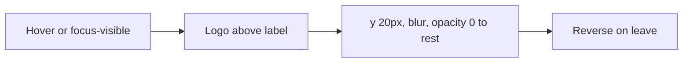

# Social hover logos

## Behavior

On hover (and keyboard `:focus-visible`) of **LinkedIn, Github, X, Medium**, show the matching SVG from [`public/assets/social-media-icons/`](public/assets/social-media-icons/) centered above the link text.

- **Enter:** start 20px below rest position (`--space-20`), blurred, opacity 0 → rest, blur 0, opacity 1
- **Exit:** reverse the same properties
- **No logo** for Email, Resume, Phone
- **Touch:** only run the motion on `(hover: hover) and (pointer: fine)`; keyboard still uses `:focus-visible`
- **Reduced motion:** skip translate/blur; opacity only (or instant)

## Shared component

Add [`src/components/SocialHoverLink/SocialHoverLink.tsx`](src/components/SocialHoverLink/SocialHoverLink.tsx) + CSS.

- Renders the existing `<a>` (external `http*` → `target="_blank"`)
- Optional `iconSrc`; if omitted, same link with no mark
- Decorative `` absolutely positioned above the label (`pointer-events: none` so it cannot steal hover)
- Parent `position: relative`; mark `left: 50%`, `bottom: 100%`, small gap via `--gap-xs`

Keep connect-prompt / footer class names on the `<a>` so existing text color, padding, and Cuelume press attributes stay in those components. The shared piece can be a `SocialHoverMark` overlay **or** a wrapper that accepts `className` + extra anchor props (`data-cuelume-press`, `onMouseEnter` for the connect “bye” label). Prefer one link component with `className` and spread props so PromptLink hover callbacks still work.

## Tokens ([`semantics.css`](src/styles/tokens/semantics.css), primitive size if needed)

Component CSS uses tokens only:

- `--size-social-hover`: `3rem` (48×48 SVGs) — add a primitive size, then a semantic alias
- `--offset-social-hover-y: var(--space-20)`
- `--blur-social-hover: var(--blur-8)`
- Transition: `opacity`, `transform`, `filter` with `--transition-expand` (smooth, matches other reveals)

## Data

In [`src/data/home.ts`](src/data/home.ts), add optional `iconSrc` on `footerLinks` for the four brands:

- `linkedin` → `/assets/social-media-icons/linkedin.svg`
- `github` → `github.svg`
- `x` → `x.svg`
- `medium` → `medium.svg`

Export that map (or the `iconSrc` fields) so Connect Prompt does not duplicate paths.

## Wiring

- [`HomeFooter.tsx`](src/components/HomeFooter/HomeFooter.tsx): use `SocialHoverLink` instead of the raw `<a>`; pass `iconSrc` when present. Keep separators.
- [`ConnectPrompt.tsx`](src/components/ConnectPrompt/ConnectPrompt.tsx): extend `PromptLink` with optional `iconSrc` and render the mark. Pass icons only on the social-step LinkedIn / Github / X / Medium links. Phone + Email unchanged.

## Clipping

Icons sit above the text. Keep `overflow: visible` on [`.connect-prompt`](src/components/ConnectPrompt/ConnectPrompt.css) / [`.connect-prompt-step`](src/components/ConnectPrompt/ConnectPrompt.css). Footer links should not clip; if a parent clips, fix that parent rather than shrinking the motion.

## Verify

Hover and keyboard-focus each of the four brands in the connect social step and in the footer. Confirm Email / Resume / Phone have no mark. Check desktop + a coarse-pointer / reduced-motion path.