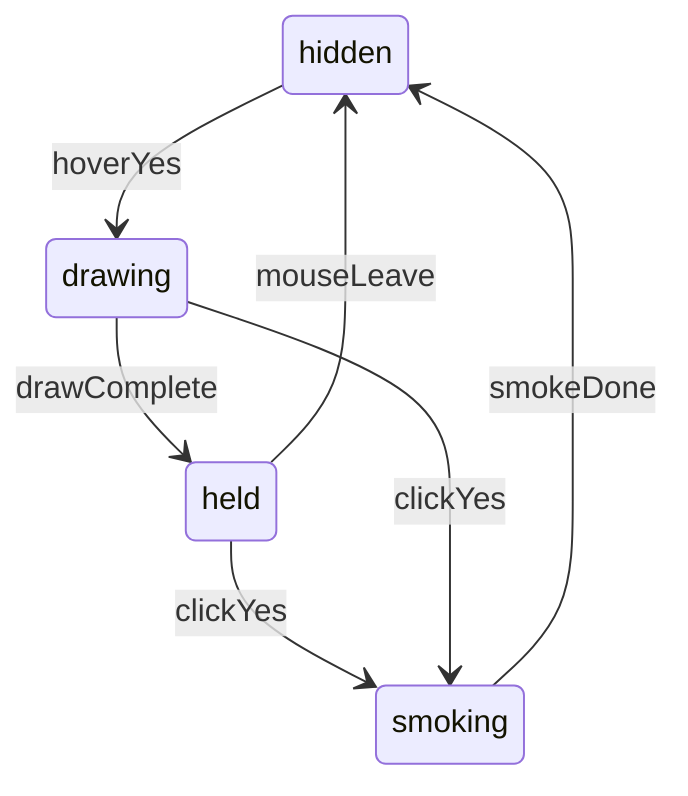

# Connect-prompt Yes hover excitement

## Behavior

Invite step only (`Wanna Connect?` / `Yes`):

- **Hover (or focus) Yes** — mount the graphic, draw it in, hold while hovered
- **Leave / blur** — hide (reverse draw or short fade); no layout shift
- **Click Yes** — play a **smoke-out** (opacity + blur) then unmount as the step changes to “How do you prefer?”
- **`prefers-reduced-motion`** — skip path drawing; opacity only
- **Touch / no-hover** — skip hover (`@media (hover: hover)`); tap still advances the prompt

The graphic is `aria-hidden` (decorative).

## Placement

Center it on the **“Wanna Connect?”** label, not the whole prompt row (icon + text).

Wrap the invite label in a relative container; position the SVG absolutely above it:

```css
.connect-prompt-invite-label {
  position: relative;
}

.connect-prompt-excitement {
  position: absolute;
  left: 50%;
  bottom: 100%;
  transform: translateX(-50%);
  pointer-events: none;
}
```

Absolute positioning so it can overlap the bio slightly without pushing the header.

## Graphic: inline SVG, not ``

[`public/assets/excitement.svg`](public/assets/excitement.svg) is 90×48 with:

- **4 burst legs** (`<line>`, stroke 2)
- **One filled “yay ;)” path**

Inline it as a small component (e.g. [`src/components/ConnectExcitement/ConnectExcitement.tsx`](src/components/ConnectExcitement/ConnectExcitement.tsx) + CSS) so each segment can use Motion `pathLength`. Recolor with `currentColor` (match `--color-text-label`). Keep the file in `public/` as the source asset; don’t load it as an image.

Draw sequence (stagger, once, then hold):

1. **Legs** — `motion.line` (or `path`) `pathLength` 0 → 1, `strokeLinecap: round`, stagger outward (~0.05–0.08s)
2. **“yay ;)”** — `motion.path` stroke draw (`pathLength` 0 → 1) then fill fades in (`fillOpacity` 0 → 1) so the filled letterforms don’t pop on as a blob

Timings live in [`src/motion/connectPrompt.ts`](src/motion/connectPrompt.ts) next to the existing phone-wave constants.

**Smoke-out (click):** wrapper `motion` exit `{ opacity: 0, filter: "blur(8px)" }` (same language as [`tabContentBlurVariants`](src/motion/tabContent.ts)), slightly quicker than the step wait (~0.2s). `AnimatePresence` on the burst so leave vs click can use different exits if needed (reverse vs smoke).

## ConnectPrompt wiring

[`ConnectPrompt.tsx`](src/components/ConnectPrompt/ConnectPrompt.tsx):

- Invite `PromptAction`: `onMouseEnter` / `onMouseLeave` / `onFocus` / `onBlur` → `yesHovered`
- Click: set a `yesBurstExiting` (or rely on step change) then `setStep("prefer")`
- Extend `PromptAction` with optional pointer/focus props (Yes only)
- Render `ConnectExcitement` inside the invite label wrapper, gated by hover **or** the smoke-out frame so click doesn’t cut the draw off mid-frame



## Tokens

In [`primitives.css`](src/styles/tokens/primitives.css) / [`semantics.css`](src/styles/tokens/semantics.css):

- Width / height from the SVG: `5.625rem` × `3rem` (90×48)
- Stroke width from existing hairline/border scale if it matches; otherwise a small size token
- No hardcoded px in component CSS

## Out of scope

Other prompt steps, looping while hovered, and changing the Yes click destination.